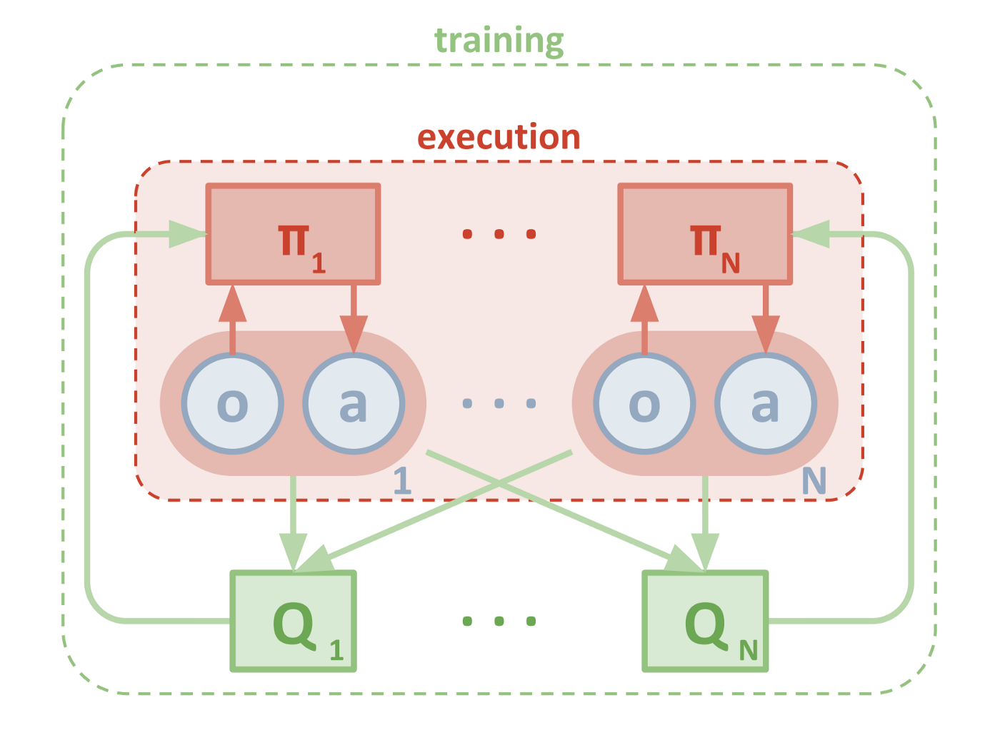

# Summary

In this report I present the implemented algorithms along with the training results and ideas for future work. The goal of the project was to solve the Tennis environment and train 2 agents to keep a ball int the air as long as possible

In this environment, two agents control rackets to bounce a ball over a net. If an agent hits the ball over the net, it receives a reward of +0.1. If an agent lets a ball hit the ground or hits the ball out of bounds, it receives a reward of -0.01. Thus, the goal of each agent is to keep the ball in play.

The observation space consists of 8 variables corresponding to the position and velocity of the ball and racket. Each agent receives its own, local observation. Two continuous actions are available, corresponding to movement toward (or away from) the net, and jumping. 

The task is episodic, and the environment is considered solved, when the average of those scores is at least +0.5 (over 100 consecutive episodes, after taking the maximum over both agents). Specifically,

- After each episode, the rewards that each agent received (without discounting) are added up, to get a score for each agent. This yields 2 (potentially different) scores. Then the maximum of these 2 scores are taken. 
- This yields a single score for each episode.

# Algorithms
## Deep Deterministic Policy Gradient (DDPG)
The algorithm introduced in the [DDPG paper](https://arxiv.org/abs/1509.02971) uses two deep neural networks, called actor and critic. Tha actor approximates the optimal policy deterministically, which means it wants to deliver the best believed action in any given state. The critic is used to approximate the maximizer over the Q values of the next state.

As DDPG could also be viewed as a DQN specifically for continuous spaces, a few features explored  for DQN will be also used with DDPG:

- **Experience replay**: When an agent interacts with the environment, the sequence of experiences can be highly correlated - causing a risk of "getting swayed" by the effects of this correlation. Instead of learning from the experience sequential, an experience buffer is maintained which is than sampled randomly during training.
- **Fixed Q-Targets**: In Q-Learning, we update a guess with a guess, and this can potentially lead to harmful correlations. To avoid this, we can update the parameters by using a separate, fixed network that is not changed during the learning step.

### Training with self play
In this implementation a single agent is trained to play with itself. In particular, there is only one agent trained - with one actor and critic network, and one experience replay buffer. This agent than acts as both "players".

## Multi-Agent Deep Deterministic Policy Gradient (MADDPG)
Open-AI [adapted](https://arxiv.org/abs/1706.02275) the DDPG algorithm introduced above to accomodate multiple agents. The new algorithm (MADDPG) uses an approach with decentralized actor and centralised critic training approach. The following diagram describes the approach very well:

The actor works similar to the  vanilla DDPG: it uses only the observations of the given agent to get the action according to the learned policy.
During (and only during) training, additional information is fed to the critic network to help stabilize the learning process: The critic network has access to the observations of *all* agents and the actions of all *other* agents as input. The action of the given agent is fed later on to the network. 

## Exploration
The exploration of the action space is done by applying noise to the action directly. I tried the following two noise versions:
- *OU-Noise*: Similar to the DDPG paper, the [Ornstein-Uhlenbeck Process](https://en.wikipedia.org/wiki/Ornstein%E2%80%93Uhlenbeck_process) is applied which produces temporally correlated noise in order to explore physical environments with momentum.It models the velocityof a Brownian particle with friction, which results in temporally correlated values centered around 0.
- *Uniformly distributed random noise* in the range (-1,1)

In both cases, the noise is reduced over time, which results in sronger emphasis on exploitation vs. exploration over time. In my experiments the simple random noise performed better.

## Prioritized Experience Replay
The idea of [PER](https://arxiv.org/abs/1511.05952) is to prioritize experiences that may be more important than others. If we sample the experience buffer uniformly, we may "miss out" on experiences that occour less frequently, but contain important information (produce a bigger TD-error) and the agent could learn much from it. In order to make sure those experiences will be selected, a probability is assigned to all experiences based on their TD-error: experiences with a higher information content (thus a higher TD-error) will be sampled with a higher probability.

# Results

In my experiments I found that using PER helps to learn faster as expected. In the DDPG version I used batch normalization in the actor and the critic network. In the MADDPG version I used  batch normalization only for the actor network. 
The agent solves the environment in 969 episodes. 
Although I did not do an extensive hyperparameter tuding, I tested multiple network structures with 2-3 hidden layers containing 256-512 units each. I found that the net structure with 2 hidden layers (400 and 300 units) worked best for both actor and critic networks. Using batch normalization and implementing prioritized experience replay led to a faster training.

## Scores
The following plot shows the scores together with the moving average with a window size of 50:

## Hyperparameters
The hyperparamters used by the agent are listed in the following table:

| Hyperparameter | Value   | Description                                             |
|----------------|---------|---------------------------------------------------------|
| BUFFER_SIZE    | 1e6     | replay buffer size                                      |
| BATCH_SIZE     | 256     | batch size                                              |
| GAMMA          | 0.99    | discount factor                                         |
| TAU            | 0.001   | factor for soft update of the target network parameters |
| LR_ACTOR       | 1e-3    | learning rate actor                                     |
| LR_CRITIC      | 1e-4    | learning rate critic                                    |
| WEIGHT_DECAY   | 0.0     | weight decay critic                                     |
| UPDATE_N_STEP  | 20      | how often to update the network                         |
| UPDATE_N_STEP  | 10      | how often the agent learns in one update                         |

For a more detailed parameter list see `src\config.py`.

## Trained Model
The trained actor model is in [this file](./results/ddpg_actor.pth).
The trained critic model is in [this file](./results/ddpg_critic.pth).

# Ideas for Future Work
**Experiment with different network structure**: The current network structure is just an example. I experimented with a few other ones, and selected the one that worked "the best" but further experiments could definitely lead to better performing structures.

**Explore the models parameter space**: in this project I focused on the implementation and first comparison of the algorithms presented int he course. I used the same hyperparameters for all agents and there is no garantee that those parameters are optimal. Therefore a systematic evaluation of the hyperparameters would be a good start, e.q. using grid search.

**Try parameter space noise** instead of the noise on the action, check [example](https://github.com/jvmncs/ParamNoise).

# Notes
The project uses the code and task description provided in the **[Udacity Deep Reinforcement Learning Nanodegree](https://www.udacity.com/course/deep-reinforcement-learning-nanodegree--nd893)**  class as a basis.